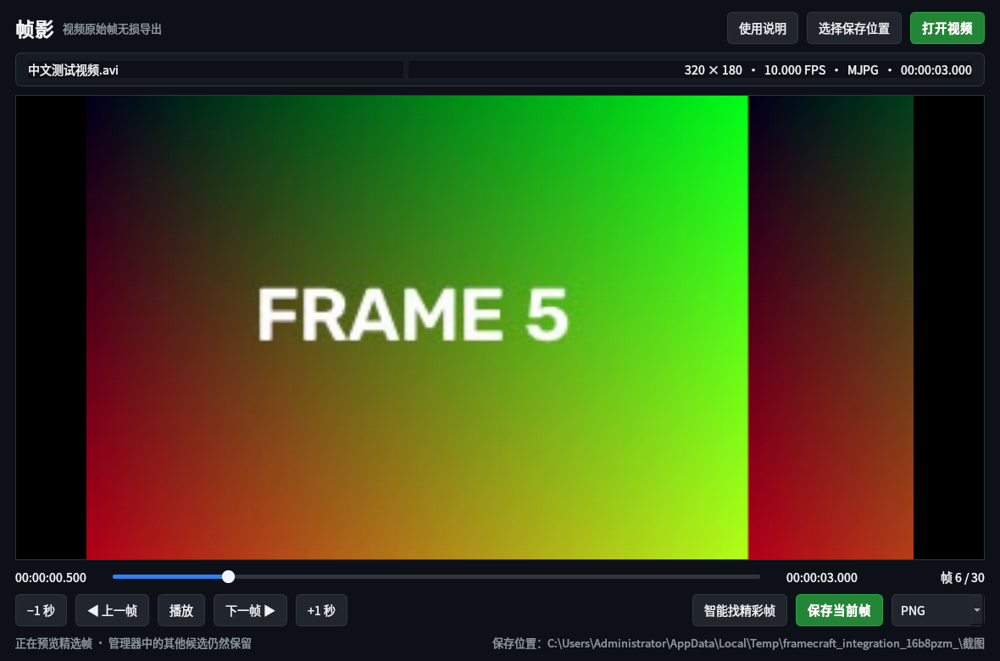
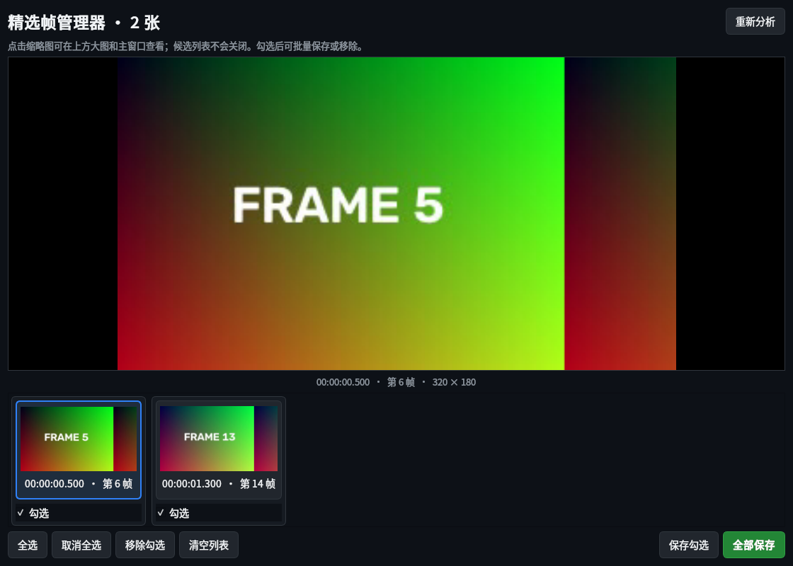

# 帧影 FrameCraft


帧影是一款面向 Windows 10/11 64 位系统的便携视频原始帧导出工具。它直接保存视频解码后的当前帧，不截取屏幕，也不会把缩放后的预览图当作截图保存。

## 下载

前往 [Releases](https://github.com/jrangus/FrameCraft-Windows/releases/latest) 下载 `FrameCraft-Windows-Portable-v1.1.0.zip`，解压后双击 `帧影 FrameCraft.exe`。

复制到其他电脑时请复制整个解压目录，不要只复制 EXE。

## 功能

- 打开或拖入 MP4、MKV、MOV、AVI、WebM 等常见视频。
- 时间轴定位、逐帧前后移动、前后跳转一秒。
- 按原始像素尺寸导出 PNG、TIFF 或 BMP。
- 本地智能筛选最多 8 个精彩帧候选，不上传视频、不需要 API。
- 精选帧管理器提供大图查看、勾选、全选、批量保存、移除、清空和重新分析。
- 点击候选帧只会切换大图与主窗口预览，候选列表不会丢失；关闭后可再次打开。
- 支持中文文件名和中文路径，自带开源中文字体。

## 界面





## 快捷键

| 快捷键 | 功能 |
| --- | --- |
| `Ctrl+O` | 打开视频 |
| `Ctrl+S` | 保存当前帧 |
| `Space` | 播放或暂停 |
| `←` / `→` | 上一帧 / 下一帧 |
| `Shift+←` / `Shift+→` | 前后跳转一秒 |

## 从源代码运行

```powershell
python -m venv .venv
.\.venv\Scripts\python.exe -m pip install -r requirements.txt
.\.venv\Scripts\python.exe framecraft.py
```

构建便携版：

```powershell
.\build_portable.ps1
```

## “无损”的边界

PNG、TIFF、BMP 保存过程中不会再次损失像素，导出尺寸与当前视频解码帧一致。视频如果原本使用 H.264、H.265 等有损编码，软件无法恢复编码之前已经丢失的细节。当前版本面向常规 8-bit SDR 视频；HDR/10-bit 专业色彩工作流尚未支持。

## 隐私与 AI

视频和智能筛选过程全部在本机完成。当前精彩帧筛选综合清晰度、曝光、对比度、饱和度和画面变化，不调用云端 AI API。

## 第三方组件

项目使用 PySide6、OpenCV、NumPy，并随程序分发 Noto Sans CJK SC 字体。字体许可证见 [`assets/Noto-CJK-LICENSE.txt`](assets/Noto-CJK-LICENSE.txt)。
